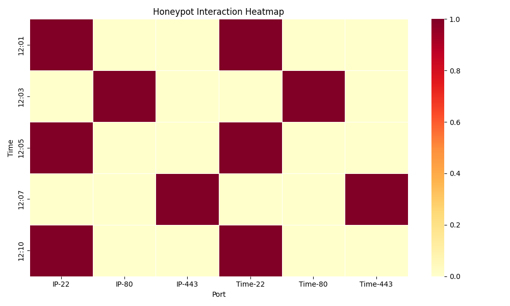

# Case Study: SSH Brute Force Attempt Visualized

## Scenario

A honeypot deployed on port 22 begins receiving repeated connection attempts from IP `192.168.1.101`. Over a 10-minute window, the attacker probes the SSH service multiple times, suggesting a brute force or credential stuffing attempt.

## Detection Workflow

1. **Log Capture**  
   The honeypot logs show repeated access to port 22 from the same IP.

2. **Heatmap Visualization**  
   Using `heatmap_builder.py`, a time-vs-port heatmap reveals concentrated activity on port 22 between 12:01 and 12:10.

3. **Anomaly Detection**  
   `anomaly_detector.py` flags `192.168.1.101` as an anomalous IP with >2 interactions.

4. **Signature Matching**  
   `signature_matcher.py` identifies the pattern as consistent with brute force behavior.

## Analyst Summary

- **Threat Type:** SSH brute force attempt  
- **Indicators:** Repeated access to port 22, single IP, short time window  
- **Response:** Flagged for investigation, potential credential protection review

## Visual Output

This heatmap shows repeated SSH access attempts from IP `192.168.1.101` to port 22 between 12:01 and 12:10.  
The concentrated activity suggests brute force behavior, confirmed by anomaly detection and signature matching.

